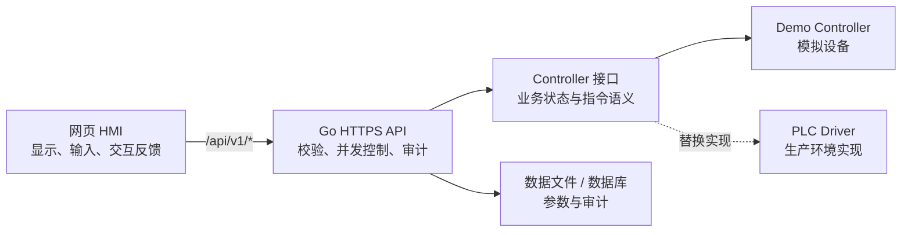

# 前后端架构与 API 接入说明

本文说明 Block 本地网页 HMI 的前后端边界、HTTPS API、审计记录以及 Block 生产环境接入单台设备/PLC 的方式。接口版本为 `v1`。

> 当前后端使用演示控制器，不会向真实 PLC 下发指令。配置 `BLOCK_HMI_DATA_FILE` 后，修改后的演示状态和审计记录会持久化。登录、会话、角色权限尚未实现，页面上的 `OPERATOR-01` 只是演示文字，不能作为真实身份或授权依据。

> **通信安全门禁**：所有实际业务 URI 必须是 `https://`，同机 HMI→Block Agent 优先使用 Unix socket，使用 loopback TCP 时也必须 HTTPS/mTLS。当前 Go 原型只有明文 HTTP，属于非合规开发原型。下文的 `HTTP` 状态码和请求报文代码块只描述 HTTP 语义，不表示允许 `http://` 监听；生产环境必须拒绝明文且不做跳转。SSH `22/tcp` 在调试期保留现状。

## 0. 产品定位和不可跨越的边界

- 本文接口是同一台 Block 内部的 `Block Local API`，服务该 Block 的本地 HMI；当前阶段一台 Block 对应一台设备。
- Block Local API 不是 BDM Client API。BDM 通过 Block Agent 的 MQTT 上报链路取得标准数据，Android Pad 只访问 BDM，不把本 API 当作远程设备接口。
- Block 必须在没有路由器、Wi-Fi、BDM 或 Pad 时独立启动并正常提供本地 HMI、数据、告警、历史和允许的现场功能。
- 当前页面中的设备命令属于 Block 本地演示交互。第一阶段 BDM 和 Pad 不远程调用这些命令，不修改参数，也不确认告警。
- 在局域网访问、认证和权限方案确认前，本地写 API 默认只应绑定本机或由本机受控反向代理访问，不应直接暴露给 Wi-Fi 网段。
- 企业服务器/云平台属于未来由 BDM 向上集成的方向，不直接访问本 API。

## 1. 架构边界



职责划分：

- 前端负责页面渲染、输入格式预检、危险操作二次确认、加载和失败状态。前端不得自行判定设备指令已经执行成功。
- 后端负责参数的最终校验、版本冲突检测、指令受理、状态读取、原子持久化和审计。所有可修改数据和设备操作必须经过后端。
- Controller 抽象设备能力。当前 Demo Controller 用于联调；生产环境应替换为只访问 `block-agent` 的本机客户端，由 `block-agent` 独占 PLC/设备连接，并保持 API 契约不变。
- PLC Driver 负责协议适配、连接管理、超时、重试边界和 PLC 状态映射，不向前端暴露寄存器地址。

皮肤、软键盘模式等纯界面偏好仍可保存在浏览器 `localStorage`；生产参数、设备状态、报警确认和审计不得只保存在浏览器。

## 2. 通用约定

- API 根路径：服务端为 `/api/v1`；默认公开子路径下也可使用 `/block-apple-style/api/v1`。
- 请求和响应编码：`application/json; charset=utf-8`
- 时间：ISO 8601 / RFC 3339，后端保存 UTC，前端按设备时区显示。
- 写请求操作员：优先读取 `X-Operator` 请求头，缺失时兼容读取请求体中的 `operator`；两处都为空时返回 `400`。这两种客户端自报身份都不应被未来的认证系统信任。
- 状态版本：`GET /state` 返回 `revision`，同时响应 `ETag: "rev-<revision>"`。写请求可传 `expectedRevision`，或发送该 ETag 作为 `If-Match`，防止覆盖其他终端刚刚完成的修改；两者同时存在时必须一致。
- 请求追踪：前端发送 `X-Request-ID`，后端会把不超过 128 字符的值写入成功操作的审计记录。
- 前端展示成功前，应以 HTTPS 成功响应中的最新状态为准；网络错误或超时不能当作操作成功。
- 生产环境必须使用受信 HTTPS、请求体大小限制、访问日志和同源策略；若使用反向代理，上游必须是 Unix socket 或 HTTPS/mTLS，不能是明文 loopback TCP。

统一错误格式：

```json
{
  "error": {
    "code": "validation_error",
    "message": "请求参数不正确",
    "fields": {
      "target": "必须是 1 到 9999 之间的整数"
    }
  }
}
```

`message` 可直接用于当前界面提示；程序逻辑应判断稳定的 `code`，不要依赖中文文案。`fields` 只在字段级校验失败时出现。

### 浏览器 API 适配器

`assets/api-client.js` 把网络细节封装为 `window.HMIBackend`，页面逻辑不应直接散落 `fetch` 调用：

| 方法 | 对应接口 |
| --- | --- |
| `getState()` | `GET state` |
| `updateSettings(settings, context)` | `PUT settings` |
| `sendCommand(command, payload, context)` | `POST commands` |
| `acknowledgeAlarm(alarmId, context)` | `POST alarms/{id}/ack` |
| `getAudit(options)` | `GET audit` |

默认 API 地址根据当前页面目录生成，因此页面位于 `/block-apple-style/` 时会请求 `/block-apple-style/api/v1/`。如需连接独立域名，可在加载 `api-client.js` 之前配置：

```html
<script>
  window.HMI_CONFIG = {
    apiBase: "https://hmi-api.example.com/api/v1/",
    requestTimeoutMs: 8000
  };
</script>
```

跨域部署还需要 API 明确允许来源和凭据；优先使用同源反向代理以减少工控 WebView 的兼容问题。客户端错误对象包含 `status`、`code` 和可选的 `fields`。

当前页面已把维护参数、设备命令、自动/手动切换和报警确认全部改为调用该适配器。导航、皮肤和软键盘模式仍是本地界面状态，不发送到后端。请求期间采用悲观更新：先禁用业务写按钮，收到后端返回的 `state` 后才刷新设备状态；断连时所有业务写操作保持禁用。

## 3. API 契约

### 3.1 读取完整状态

```http
GET /api/v1/state
```

成功响应：

```json
{
  "state": {
    "revision": 12,
    "running": true,
    "mode": "auto",
    "singlePaused": false,
    "framePaused": false,
    "target": 30,
    "toolLimit": 100,
    "inspectInterval": 30,
    "output": 30,
    "cycle": 30,
    "oee": 92,
    "inspected": 30,
    "passed": 30,
    "ng": 0,
    "pending": 30,
    "blank": 30,
    "finished": 30,
    "bins": [],
    "alarms": [],
    "history": [],
    "updatedAt": "2026-07-21T02:15:04Z"
  }
}
```

前端首次打开页面时读取一次，页面可见且联机时每 2 秒刷新；离线时每 5 秒重连；页面隐藏后的后续轮询间隔为 8 秒，重新可见时立即刷新。当前服务返回 ETag，但尚未实现 `If-None-Match`/`304 Not Modified`，因此每次轮询仍会收到完整快照。生产接入时可根据 PLC 更新频率调整，避免多个终端形成高频请求。

### 3.2 修改维护参数

```http
PUT /api/v1/settings
X-Operator: OPERATOR-01
Content-Type: application/json
```

```json
{
  "target": 30,
  "toolLimit": 100,
  "inspectInterval": 30,
  "expectedRevision": 12
}
```

字段范围：

| 字段 | 类型 | 范围 | 含义 |
| --- | --- | --- | --- |
| `target` | 整数 | 1–9999 | 产能设定 |
| `toolLimit` | 整数 | 1–99999 | 换刀件数设定 |
| `inspectInterval` | 整数 | 1–9999 | 抽检间隔设定 |
| `expectedRevision` | 整数，可选 | 当前正整数版本 | 用户开始编辑时看到的状态版本 |
| `operator` | 字符串，可选 | — | 兼容字段；`X-Operator` 优先 |

成功响应为 `{"state": {...}, "message": "维护参数已保存"}`。若 `expectedRevision` 或 `If-Match` 已过期，返回 `409 revision_conflict`；前端应刷新数据并请操作员重新确认，不能静默覆盖。

### 3.3 下发设备操作

```http
POST /api/v1/commands
X-Operator: OPERATOR-01
Content-Type: application/json
```

基本请求：

```json
{
  "command": "start"
}
```

支持的命令和附加字段：

| `command` | 附加字段 | 页面操作 |
| --- | --- | --- |
| `start` | 无 | 启动 |
| `pause` | 无 | 暂停 |
| `reset` | 无 | 复位 |
| `clear_bins` | 无 | 清空料仓；前端仍需二次确认 |
| `inspect` | 无 | 完成一次抽检 |
| `set_mode` | `mode: "auto" \| "manual"` | 自动/手动切换 |
| `set_single_paused` | `paused: boolean` | 单件循环暂停/恢复 |
| `set_frame_paused` | `paused: boolean` | 单框循环暂停/恢复 |

请求也可包含 `expectedRevision` 和兼容字段 `operator`，但 `X-Operator` 优先。成功响应为 `{"state": {...}, "message": "..."}`。后端必须重新检查命令合法性和设备联锁；前端的禁用状态、确认按钮不构成安全控制。

### 3.4 确认报警

```http
POST /api/v1/alarms/3/ack
X-Operator: OPERATOR-01
Content-Type: application/json
```

```json
{}
```

请求体可带 `expectedRevision` 和兼容字段 `operator`。成功响应为 `{"state": {...}, "message": "报警 3 已确认"}`。不存在的报警返回 `404 alarm_not_found`。当前演示控制器会接受重复确认并为每个成功请求增加 revision 和审计记录；调用端应避免重复点击。

### 3.5 查询审计记录

```http
GET /api/v1/audit?limit=50&beforeId=1200
```

- `limit`：单页数量，客户端应使用后端允许的上限。
- `beforeId`：读取该记录之前的更早记录，用于向后翻页；首页省略。

响应示例：

```json
{
  "items": [
    {
      "id": 1200,
      "timestamp": "2026-07-21T02:15:04Z",
      "operator": "OPERATOR-01",
      "action": "settings.update",
      "message": "维护参数已保存",
      "revision": 12,
      "requestId": "req-01J...",
      "details": {
        "before": { "target": 20, "toolLimit": 100, "inspectInterval": 30 },
        "after": { "target": 30, "toolLimit": 100, "inspectInterval": 30 }
      }
    }
  ],
  "nextBeforeId": 1200
}
```

没有更多记录时可省略 `nextBeforeId`。

HMI 的“历史记录”页当前读取 `/state` 中最近 100 条 `history`；`/audit` 保存更完整的操作员审计（最多 2000 条），已由 API 客户端封装但尚未接到该页面的分页界面。

## 4. 数据和操作流

### 页面加载与刷新

1. 前端请求 `GET /api/v1/state`。
2. 后端读取 Controller 状态，补充当前 `revision` 和时间。
3. 前端一次性替换界面快照，避免分别读取多个字段造成数据来自不同周期。
4. 当前前端按固定周期重复读取完整快照，并在写请求中携带 `revision`。服务端同时返回 `ETag` 供其他客户端做并发控制，但当前轮询尚未发送 `If-None-Match`。连续失败时保留最后快照，但必须显示“数据已过期/连接中断”，不得继续显示为“远程联机”。

### 修改维护参数

1. 前端对整数和范围做即时提示。
2. 操作员点击“保存参数”，前端发送三个完整字段及可选的 `expectedRevision`。
3. 后端再次校验范围和版本，再由 Controller 应用参数。
4. 后端成功后将新状态和审计记录作为同一个快照原子持久化。
5. 前端只使用响应中的最新状态更新页面；失败则保留输入并展示错误。

### 下发设备命令

1. 前端对危险命令进行二次确认，但不提前修改最终设备状态。
2. 后端检查命令、操作员、设备状态和生产联锁。
3. Controller/Driver 将业务命令转换为 PLC 协议操作，并读取回执或状态反馈。
4. 当前演示后端在成功后写入审计并返回最新状态；生产 Driver 还必须补充失败审计。
5. 前端根据响应渲染结果。HTTP 超时后的结果不确定时，应重新读取 `/state`，不要自动重复危险命令。

## 5. 操作员、认证与权限

当前版本只要求写请求提供非空 `X-Operator`，这是为了把操作来源写入演示审计，不是认证。客户端可以伪造该请求头，因此不能据此授予生产权限。

正式上线前需要另行实现：

- 登录接口和服务端会话；密码只发送给认证接口，不能写入 `localStorage`、审计或日志。
- 生产数据查看、维护参数、报警确认和设备命令的角色权限。
- 会话过期、主动退出、连续失败锁定和必要的密码策略。
- 由后端会话生成可信操作员身份，并忽略客户端自报的 `X-Operator`/`operator`。
- 主界面的操作员名称由会话接口返回，不能继续硬编码 `OPERATOR-01`。

在这些能力完成前，本项目适合界面演示和受控联调，不应作为真实设备的安全边界。

## 6. 审计要求

当前演示控制器会为成功的维护参数修改、启动、暂停、复位、清空料仓、抽检、模式切换、循环暂停/恢复和报警确认产生审计记录。单机数据文件最多保留最近 2000 条。每条当前记录包含：

- 递增 ID 和 UTC 时间；
- 操作员、动作、结果消息和产生后的 revision；
- 参数修改前后值或命令参数（位于 `details`）；
- 可选请求 ID。

当前实现只记录成功操作。生产 PLC Driver 上线前还应扩展失败审计，记录稳定错误码、设备/工位 ID 和 PLC 回执编号；这些字段尚未由演示控制器实现。

不得记录密码、会话令牌或不必要的个人信息。生产环境应将审计存储设为追加写，限制普通操作员修改/删除，并按工厂合规要求配置保留期和备份。

## 7. PLC Driver 接入

生产 Driver 应实现与 Demo Controller 相同的业务能力，而不是让 HTTP 层直接读写寄存器。推荐边界：

- `State`：一次读取能组成一致快照的运行状态、计数、料仓和报警。
- `UpdateSettings`：校验后写入参数，并读取回写值确认。
- `ExecuteCommand`：接收业务命令，负责映射寄存器/位、联锁、超时和回执。
- `AcknowledgeAlarm`：按报警标识确认，并处理重复确认。
- `Health`：区分 API 可用、PLC 断开和数据过期。

接入规则：

1. PLC 地址、点位和协议配置只存在于后端部署环境，不进入前端包。
2. 同一 PLC 使用单写入通道或队列，避免并发命令交错。
3. 读取可有限重试；启动、清仓、复位等非天然幂等写操作不能在结果未知时盲目重试。
4. HTTP 层设置明确超时，并将协议错误映射为统一 API 错误码。
5. 只有收到 PLC 回读/回执后才把操作标记为成功；“已发送”与“已执行”应有不同语义。
6. PLC 连接中断时，前端显示最后更新时间和离线状态，并禁用不安全的写操作。

## 8. 错误码

以下是当前后端已返回的错误码，均为小写：

| HTTP | `code` | 场景 | 前端处理 |
| --- | --- | --- | --- |
| 400 | `malformed_json` | 请求体为空、JSON 无法解析、含未知字段或多个 JSON 值 | 修正客户端请求 |
| 400 | `operator_required` | 写请求没有操作员 | 阻止操作并提示重新进入/登录 |
| 400 | `invalid_revision` | `If-Match` 格式错误或与请求体版本不一致 | 使用最近一次状态的 ETag/revision |
| 404 | `alarm_not_found` | 报警不存在 | 刷新状态 |
| 404 | `not_found` | API 路径不存在 | 显示通用错误并检查版本 |
| 405 | `method_not_allowed` | HTTP 方法错误 | 视为客户端版本错误 |
| 409 | `revision_conflict` | 状态版本已变化 | 刷新并要求重新确认 |
| 413 | `request_too_large` | JSON 请求体超过 64 KiB | 不应重试，修正客户端 |
| 415 | `unsupported_media_type` | 写请求不是 `application/json` | 修正 `Content-Type` |
| 422 | `validation_error` | 字段缺失、类型、范围、分页或命令错误 | 标记 `fields` 对应输入 |
| 503 | `backend_unavailable` | Controller 或持久化不可用 | 保留输入，稍后重试读取 |

浏览器 API 客户端还会在本地生成 `network_error`、`timeout`、`invalid_json` 和兜底的 `request_failed`；它们不是服务端响应。客户端会发送 `Idempotency-Key`，但当前后端尚未实现幂等键去重，因此超时后不得自动重复清仓、复位等危险命令。

生产 PLC Driver 可再增加例如 `state_conflict`、`plc_unavailable`、`plc_timeout` 等错误码，但尚未实现，新增后应保持在 `v1` 内语义稳定。
